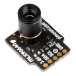

# Heatcam
Merge high res raspberry pi camera output with low res heat cam output

Requirements
------------
Raspberry Pi

Rpi camera

MLX906040 thermal camera breakout from [pimoroni](https://shop.pimoroni.com/products/mlx90640-thermal-camera-breakout?variant=12536948654163)

[mlx90640 library](https://github.com/pimoroni/mlx90640-library)

